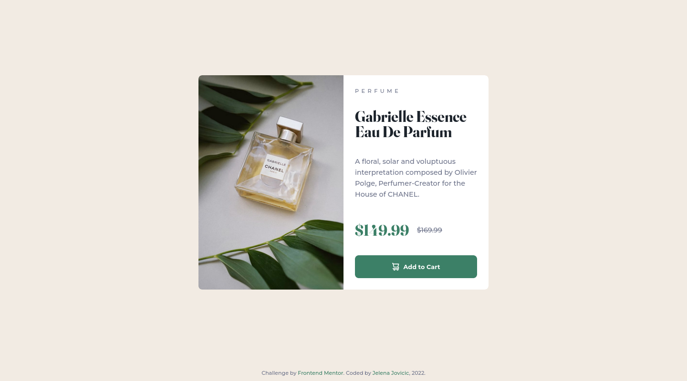

# Frontend Mentor - Product preview card component

This is a solution to the [Product preview card component challenge on Frontend Mentor](https://www.frontendmentor.io/challenges/product-preview-card-component-GO7UmttRfa). Frontend Mentor challenges help you improve your coding skills by building realistic projects. 

## Table of contents

- [Overview](#overview)
  - [Description](#description)
  - [Screenshot](#screenshot)
  - [Links](#links)
- [The process](#the-process)
  - [Built with](#built-with)
  - [Observations](#observations)
  - [Useful resources](#useful-resources)
- [Author](#author)
- [Acknowledgments](#acknowledgments)

## Overview

### Description

A simple challenge, to get back on track after a break.

### Screenshot

### Links

- [Repo](https://github.com/je-jo/product-preview-card-component)
- [Live Site](https://je-jo.github.io/product-preview-card-component/)

## My process

### Built with

- Semantic HTML5 markup
- CSS custom properties
- Flexbox
- Mobile-first workflow

### Observations

- Had trouble making equal width columns with flexbox, because of one element's padding. See useful resources below.

### Useful resources

- [My Basic Template](https://github.com/je-jo/basic-template) pretty much based on Stephanie Eckless' [HTML / Sass Jumpstart](https://github.com/5t3ph/html-sass-jumpstart) but much simpler;
- [Equal Columns With Flexbox: It’s More Complicated Than You Might Think](https://css-tricks.com/equal-columns-with-flexbox-its-more-complicated-than-you-might-think/) - If only some of the columns have padding, the cleanest flexbox solution is to nest the element with the padding on it.

## Author

- [Github](https://github.com/je-jo)
- [Frontend Mentor](https://www.frontendmentor.io/profile/je-jo)
- [Codepen](https://codepen.io/je-jo)
- [Twitter](https://twitter.com/jelena_jo_)

## Acknowledgments

- [Solution by Julio Cinquina](https://github.com/JulioCinquina/fem-product-preview-card) - A fellow learner presented a solution to an accessibility issue that I wasn't even aware of: most screen readers do not describe crossed-out text as such. Solved by including a visually hidden sentence describing the prices, and hiding displayed prices from screen readers. 